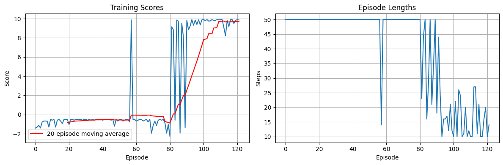
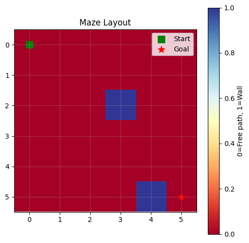
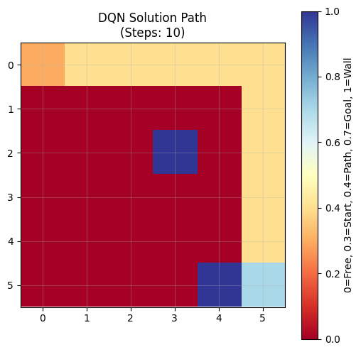
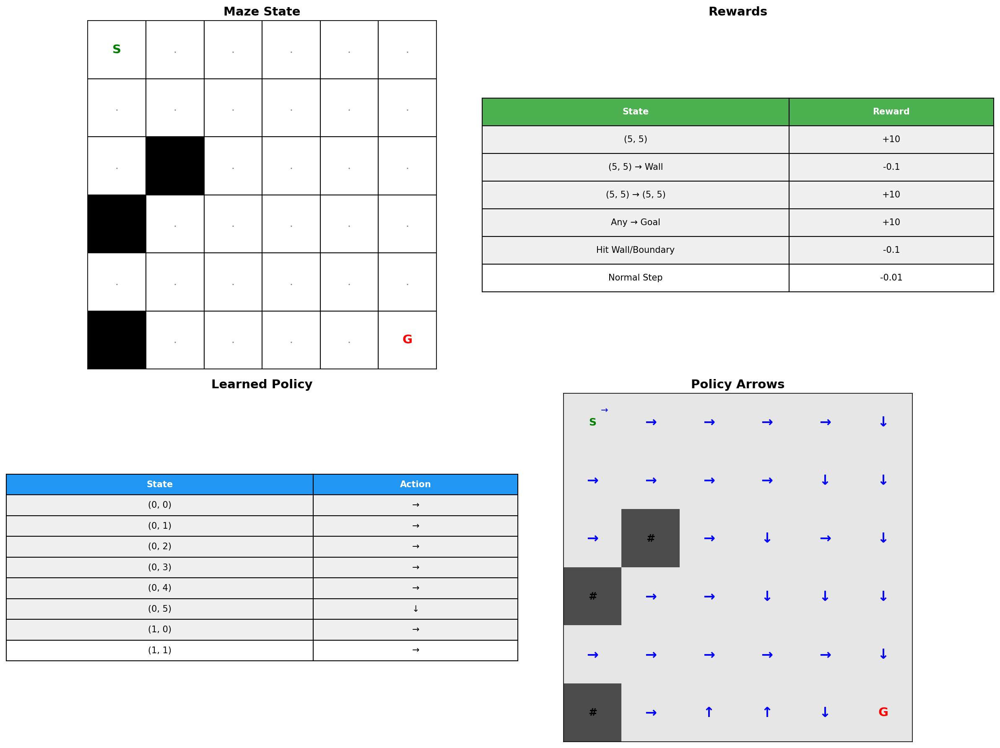
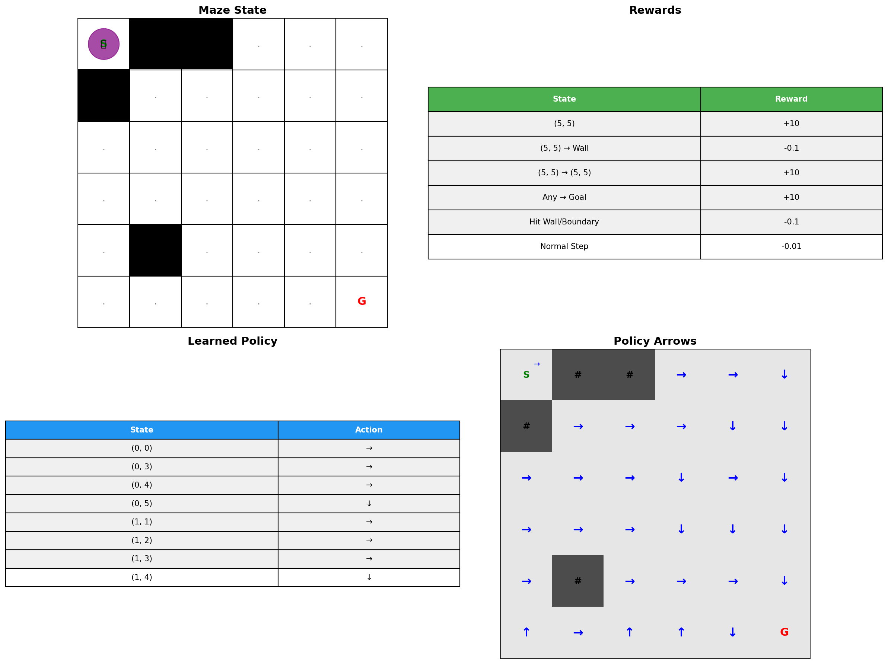
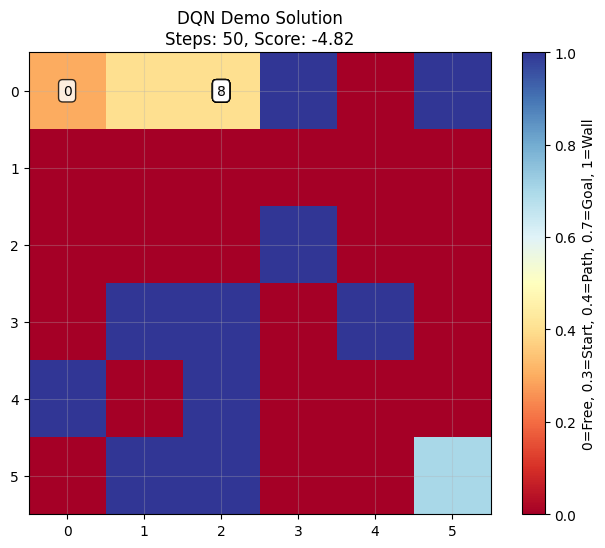

# Deep Q-Network (DQN) Maze Solver

A vanilla Deep Q-Network implementation for solving randomly generated mazes using reinforcement learning.

## Overview

This project implements a classic Deep Q-Network (DQN) agent that learns to navigate through randomly generated mazes to reach a goal position. The implementation demonstrates core reinforcement learning concepts including experience replay, target networks, and epsilon-greedy exploration.

## Technique

### Vanilla DQN Algorithm

The implementation follows the original DQN paper (Mnih et al., 2015) with these key components:

1. **Experience Replay**: Stores experiences (state, action, reward, next_state, done) in a replay buffer and samples random batches for training to break temporal correlations
2. **Target Network**: Uses a separate target network for stable Q-value estimation, updated via soft updates
3. **Epsilon-Greedy Exploration**: Balances exploration vs exploitation with decaying epsilon
4. **Neural Network**: 4-layer fully-connected network (128 neurons per hidden layer) that maps states to Q-values

### Environment Design

- **State Representation**: Flattened binary grid showing agent position (36 features for 6x6 maze)
- **Action Space**: 4 discrete actions (up, right, down, left)
- **Reward Structure**: 
  - +10.0 for reaching the goal
  - -0.1 for hitting walls or boundaries  
  - -0.01 for each step (encourages efficiency)

## Results

### Training Performance

- **Training Time**: 2.74 seconds
- **Convergence**: Solved in 122 episodes  
- **Final Success Rate**: 100% (3/3 test episodes on training environment)
- **Optimal Solution**: Consistently found 10-step paths

### Training Progress

The agent showed rapid learning with clear convergence:

*Training scores and episode lengths over time showing successful convergence*

### Maze Environment

*Example 6x6 maze with start position (green) and goal (red)*

### Solution Visualization

*DQN agent's learned solution path through the maze*

### Advanced Comprehensive Analysis

*Comprehensive 4-panel visualization showing: Maze State, Rewards Structure, Learned Policy, and Policy Arrows - similar to academic RL visualizations*

### Step-by-Step Analysis

*Detailed step-by-step analysis with agent position and comprehensive policy information*

### Generalization Analysis

The trained agent demonstrated excellent performance on mazes similar to training conditions but showed limited generalization to significantly different maze configurations (higher wall density). This highlights a common challenge in RL: agents can overfit to their training distribution.

*Example of agent behavior on a different maze configuration*

## Key Findings

✅ **Successful Learning**: The DQN agent successfully learned optimal navigation strategies  
✅ **Fast Convergence**: Achieved good performance in under 3 seconds of training  
✅ **Stable Performance**: Consistent 100% success rate on similar maze configurations  
⚠️ **Limited Generalization**: Performance degrades on mazes with different characteristics  

## Technical Implementation

- **Framework**: PyTorch for neural networks
- **Environment**: Custom OpenAI Gym-style maze environment
- **Visualization**: Matplotlib for training plots and maze visualizations
- **Architecture**: Modular design with separate environment, network, and agent classes

